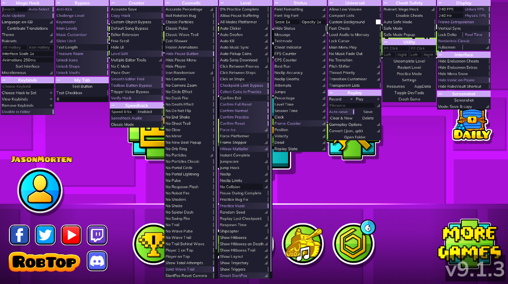

# MH Extensions

A convenient API for **Mega Hack** extensions: add your own tabs, buttons, checkboxes, and spinners from C++ — without manually writing JSON, hard-coded paths, or dealing with listeners. You can also read and monitor built-in MH hacks.

```cpp
mh::Tab tab("MY_TAB", "My Tab");

tab.button("RUN", "Run", [] { log::info("clicked"); })
   .checkbox("ENABLED", "Enabled", true)
   .layout("SPEED_ROW", "Speed", [](mh::Layout& row) {
       row.spinner("SPEED", "Speed", 1.0, {.min = 0.1, .max = 10.0, .step = 0.1});
   });

tab.registerTab();
```

<p align="center">
  
</p>

Previously, the same thing took ~70 lines: JSON in `stringstream`, five `addDefinition` calls, three `set*` calls with long paths, and a separate button listener registration (see [`src/examples/01_basic_tab.cpp`](src/examples/01_basic_tab.cpp)).

> **Status:** The builder was checked against a stub Mega Hack (the test harness is not part of this repo), and all 29 symbols have been checked against the export table of `absolllute.megahack.dll`. See [What Was Not Verified](#what-was-not-verified) for the list of assumptions.

---

## Contents

- [Quick Start](#quick-start)
- [How It Works](#how-it-works)
- [Widgets](#widgets)
- [Values and Persistence](#values-and-persistence)
- [When to Register a Tab](#when-to-register-a-tab)
- [Widgets Not Included in the Builder: `raw()`](#widgets-not-included-in-the-builder-raw)
- [Low-Level API](#low-level-api)
- [What Was Not Verified](#what-was-not-verified)
- [Common Problems](#common-problems)

---

## Quick Start

1. Copy the [`src/mh/`](src/mh) folder into your Geode mod.

2. Add the folder to the include paths in `CMakeLists.txt` and include the source files:

   ```cmake
   file(GLOB MH_SOURCES CONFIGURE_DEPENDS src/mh/*.cpp)
   add_library(${PROJECT_NAME} SHARED src/main.cpp ${MH_SOURCES})
   target_include_directories(${PROJECT_NAME} PRIVATE src)
   ```

3. In `mod.json`, keep only Windows (the code uses WinAPI):

   ```json
   "gd": { "win": "2.2081" }
   ```

4. Create the tab:

   ```cpp
   #include <Geode/Geode.hpp>
   #include <mh/mh.hpp>

   using namespace geode::prelude;

   static void setup() {
       static mh::Tab tab("MY_TAB", "My Tab");

       tab.checkbox("GODLY", "Godly mode", false, [](bool on) { log::info("godly: {}", on); })
          .spinner("SPEED", "Speed", 1.0, {.min = 0.1, .max = 10.0, .step = 0.1})
          .button("PRINT", "Print", [] {
              log::info("speed = {}", tab.get<double>("SPEED"));
          });

       if (!tab.registerTab()) log::error("MY_TAB: {}", tab.lastError());
   }

   $on_mod(Loaded) {
       // Called when MH is found and the main menu has opened
       mh::onReady(setup);
   }
   ```

The project itself contains a ready-made demo with two examples: `-DMH_BUILD_EXAMPLES=ON` (enabled by default), code in [`src/examples/`](src/examples). For a production mod, simply don't copy `src/examples`, or build with `-DMH_BUILD_EXAMPLES=OFF`.

**Requirements:** Windows, Geode SDK (`GEODE_SDK`), C++20 (designated initializers are required for `{.min = …}`). Build with the same toolchain as other Geode mods: `std::string`, `std::function`, and `std::vector` cross the boundary into Mega Hack, so the STL and CRT must match.

---

## How It Works

```text
src/mh/
├─ mh.hpp        The only header needed for inclusion
├─ api.hpp/.cpp  A thin wrapper around MH exports (GetProcAddress), with no Geode in the header
├─ ui.hpp/.cpp   Tab builder: JSON, labels, default values, persistence, listeners
└─ glue.cpp      Geode glue: persistence in the mod's saved values and onReady()
```

When you call `tab.registerTab()`, exactly this happens:

1. **Definition validation** — IDs may contain only `A-Z a-z 0-9 _`, with no duplicates within the same container, `min ≤ max`, `step > 0`, and no empty layouts. On error → `false` and a message in `tab.lastError()`; nothing is sent to Mega Hack.
2. **Names** — `addDefinition(path, name)` is called for the tab and every widget.
3. **Values** — Default values are written to the MH config, or previously saved values are used if available (clamped to `[min, max]`).
4. **Tab** — JSON is generated and passed to `registerTab`.
5. **Listeners** — Attached *after* successful registration (only then has MH created the elements and tags): buttons, value changes, and persistence.

### Keys (Paths)

A value key is the ID from the tab downward, separated by `/`. For the README example:

| Widget | Key |
|---|---|
| tab | `MY_TAB` |
| `button("RUN")` | `MY_TAB/RUN` |
| `layout("SPEED_ROW")` | `MY_TAB/SPEED_ROW` |
| `spinner("SPEED")` inside layout | `MY_TAB/SPEED_ROW/SPEED` |

You don't need to write them manually: `tab.get<T>("SPEED")` accepts a short ID (if it is unique within the tab) or a relative path `SPEED_ROW/SPEED`. The full key is returned by `tab.path("SPEED")`.

---

## Widgets

| Method | JSON Type | Value in MH Config | Listener |
|---|---|---|---|
| `button(id, label, onClick)` | `button` | — | `onClick()` |
| `checkbox(id, label, def, onChange)` | `checkbox` | `bool` | `onChange(bool)` |
| `spinner(id, label, def, {min,max,step}, onChange)` | `spinner`, `decimal: true` | `double` | `onChange(double)` |
| `integer(id, label, def, {min,max,step}, onChange)` | `spinner`, `decimal: false` | `int64` | `onChange(double)` |
| `textbox(id, label, def, onChange)` | `textbox` | `string` | `onChange(string const&)` |
| `layout(id, label, [](mh::Layout& l){…})` | `layout` | — | — |
| `raw(json, defs)` | any | Handled manually | Handled manually |

* `Range` format: `{.min = 0, .max = 100, .step = 1}` (defaults to `0 / 100 / 1`).
* `layout` can be nested; the same methods are available inside the lambda.

---

## Values and Persistence

```cpp
double speed = tab.get<double>("SPEED"); // Reads the value according to the widget's type and converts it to T
int    count = tab.get<int>("COUNT");
bool   on    = tab.get<bool>("ENABLED");

tab.set("SPEED", 2.5);                   // Clamped to [min, max], written, and persisted
```

- `get<T>()` for a nonexistent or ambiguous ID returns `T{}` and writes a warning to the log.
- By default, values are **persisted between runs** in your mod's saved values (keys such as `mhext/MY_TAB/SPEED`). Disable with: `tab.persist(false)`. Replace the storage with: `mh::setStorage(...)` (the `mh::Storage` interface).
- Default values are applied on **every** registration, but saved values are used when available. Previously, the original code unconditionally called `setBool(…, false)` on startup, which could reset values on every launch.

Tab-wide events:

```cpp
tab.onOpen([]   { /* MH menu opened */ })
   .onCommit([] { /* Menu closed, values committed */ })
   .onUnload([] { /* Cleanup */ });
```

---

## When to Register a Tab

Mega Hack does not load instantly, so don't register tabs directly in `$on_mod(Loaded)`. Use:

```cpp
mh::onReady(setup);     // After the main menu opens
mh::onReady(setup, 30); // ...and another 30 frames later if MH takes longer to load on your machine
```

If Mega Hack is not installed, `setup` simply isn't called (one line is written to the log), so there is nothing to crash. Previously, a detach thread was used for this; it only called `queueInMainThread`, did not actually wait for anything, and can be removed.

---

## Widgets Not Included in the Builder: `raw()`

`interface.json` also contains other types: `combobox`, `colour`, `shortcut`, `picker`, `selectbox`, `option` (main element + dropdown block), `dropdown`. The builder does not wrap them yet — their values are non-standard, and I have not verified exactly how MH stores them. They are available through `raw()`:

```cpp
tab.raw(R"({ "type": "combobox", "id": "MODE" })",
        { {"MY_TAB/MODE", "Mode"} }); // Full path -> name

mh::extensions::registerIntListener("MY_TAB/MODE", [](mh::Tag, int64_t const& v) {
    // Custom handling
});
```

With `raw()`, you are responsible for `addDefinition` (the `defs` parameter), default values, and listeners. The only validation is that the string is a single JSON object `{ … }`.

---

## Low-Level API

Everything exported by Mega Hack is available directly through `mh::extensions::*` (see [`api.hpp`](src/mh/api.hpp) for details):

| Group | Functions |
|---|---|
| Values | `get/set` × `Bool`, `Int`, `Double`, `String`, `Bytes` |
| MH Hacks | `isHackEnabled`, `setHackEnabled`, `registerHackListener` |
| Listeners | `registerBool/Int/Double/String/BytesListener`, `registerActionListener` |
| Tabs | `registerTab(json or istream, delegate)`, `addDefinition` |
| Messages | `showMessage(type, text, onClose)`, `showError` |
| Tags | `tagFor(key)`, `keyFor(tag)`, `define(key)` |
| Safe mode | `mh::safe_mode::areCheatsEnabled / hasCheatedInAttempt / disableAllCheats` |
| Utilities | `mh::init()`, `mh::isReady()`, `mh::missingSymbols()` |

`mh::init()` checks all required symbols. If something is missing in your version of Mega Hack, it returns `false` and the log reports *which* symbols are missing (previously, a missing function silently became a no-op). Only the three `safe_mode` functions are optional.

---

## What Was Not Verified

Here is the honest list of assumptions I could not verify without running Geode and Mega Hack:

1. **Delegate layout**: Slot 0 — destructor, 1 — `onOpen`, 2 — `onCommit`, 3 — `onUnload`. The first two come from the source code; `onUnload` (slot 3) is an assumption.
2. **Value type of `integer()`**: I assume `decimal: false` is stored as `int64` (read with `getInt`). To verify: the demo contains `COUNT` and a *Print values* button; if it prints zeros for a non-zero value, the type is different.
3. **`setBool(<tab id>, true)`** before registration is kept as in the original working example; I have not confirmed why MH needs it.
4. **When value listeners fire** (on every click or only when the menu closes) — not verified; for reliability, read `get<T>()` in `onCommit`.
5. **MH loading timing**: `onReady()` waits for the main menu. If `registerTab` still returns `false` on a slow load, add a delay with `onReady(setup, N)`.
6. **No unregistration**: Mega Hack has no export for removing listeners and delegates, so everything you register lives until the game ends (the builder keeps its state alive).

---

## Common Problems

| Symptom | Cause / What to Do |
|---|---|
| `Mega Hack not found` in the log | MH is not installed or `absolllute.megahack` is not loaded. Extensions are skipped — this is normal. |
| `this version of Mega Hack is missing required exports: …` | This MH version is missing part of the API. The message lists the missing symbols. |
| `registerTab` returned `false` | Check `tab.lastError()` |
| Widget value is always 0 | Make sure you are reading the correct ID (`tab.path("ID")` returns an empty string if it is not found) and the correct widget type (`integer` ≠ `spinner`). |
| The tab appeared twice | Don't call `registerTab()` for a new `mh::Tab` with the same ID; calling it again on the same object is safe. |
| Crash after `showMessage` | Previously, an empty `std::function` in `onClose` was passed to MH as-is; now a safe no-op is supplied. |
